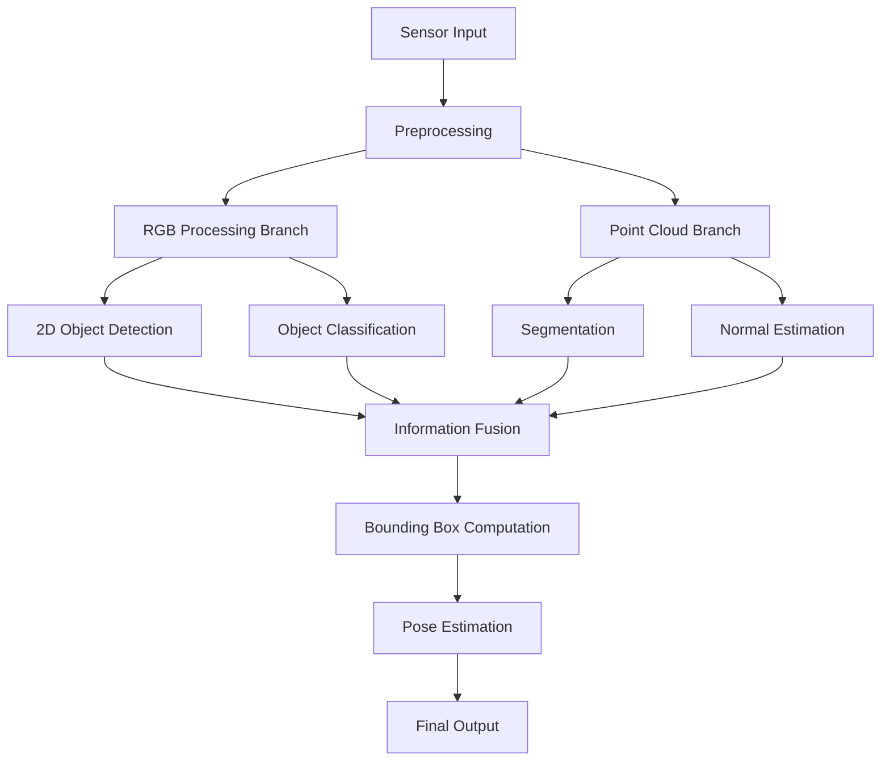

```mermaid
flowchart TD
    Input[Sensor Input] --> PreProc[Preprocessing]
    PreProc --> RGB_Branch[RGB Processing Branch]
    PreProc --> PCL_Branch[Point Cloud Branch]
    
    RGB_Branch --> 2D_Det[2D Object Detection]
    RGB_Branch --> Class[Object Classification]
    
    PCL_Branch --> Segment[Segmentation]
    PCL_Branch --> Normal[Normal Estimation]
    
    2D_Det --> Fusion[Information Fusion]
    Class --> Fusion
    Segment --> Fusion
    Normal --> Fusion
    
    Fusion --> BB[Bounding Box Computation]
    BB --> Pose[Pose Estimation]
    Pose --> Output[Final Output]
```
