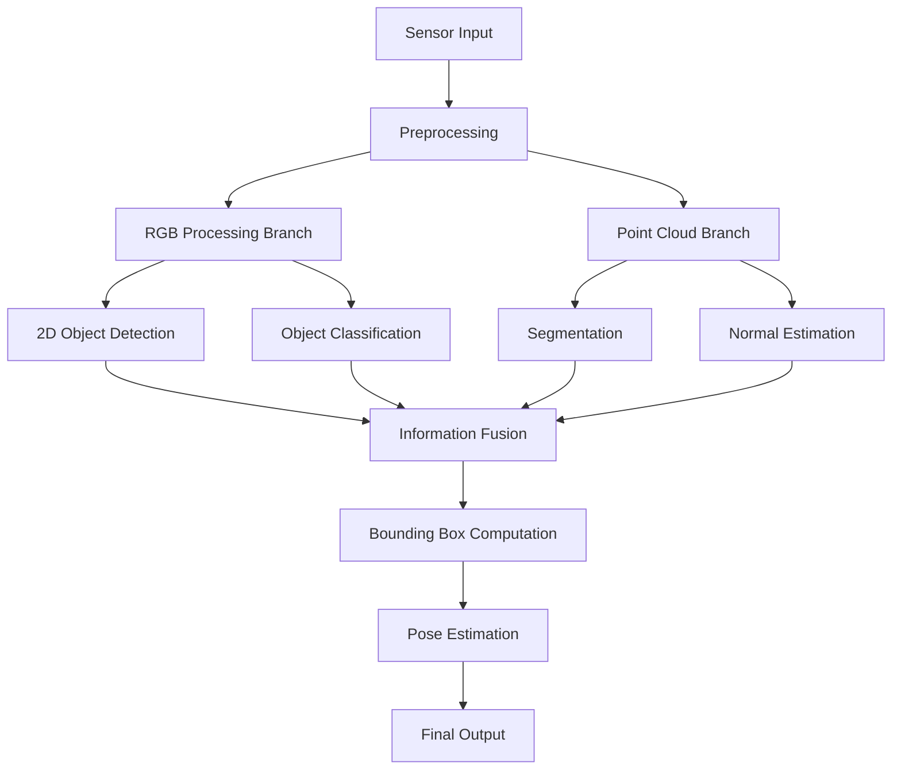

# To DO
- [x] Custom message for PC DET
- [x] Custom message for RGB DET
- [x] modify perception to publish clusters in Custom msg
- [x] node to visualize clusters
- [x] remove plane
- [x] publish pose for each cluster Eigen Vectors + normal estimation(plane)
- [x] RGB DET NODE
- [x] FUSING NODE
- [ ] RGB DET NODE (migrate -> client)
- [ ] Integrating RGB server to perception
- [ ] Publish tf2
- [ ] 6DOF
- [ ] Testing on real feed
---
> [!WARNING]
> While visualizing pose use you'r camera frame to avoid segmentation fault on rviz.
---

