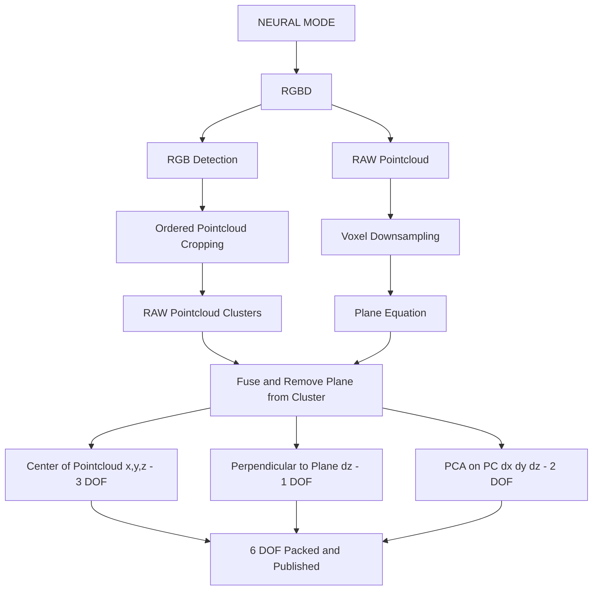

## TODO
- [x] Capture pointcloud and image
- [x] Process Depth Feed
- [x] Process Rgb Feed
- [ ] Combine both
- [ ] convert into Action Server mode

```mermaid
flowchart TB
    A[NEURAL MODE] --> B[RGBD]

    B --> C[RGB Detection]
    C --> D[Ordered Pointcloud Cropping]
    D --> E[RAW Pointcloud Clusters]

    B --> F[RAW Pointcloud]
    F --> G[Voxel Downsampling]
    G --> H[Plane Equation]

    E --> I[Fuse and Remove Plane from Cluster]
    H --> I

    I --> J[Center of Pointcloud x,y,z - 3 DOF]
    I --> K[Perpendicular to Plane dz - 1 DOF]
    I --> L[PCA on PC dx dy dz - 2 DOF]

    J --> M[6 DOF Packed and Published]
    K --> M
    L --> M
```
