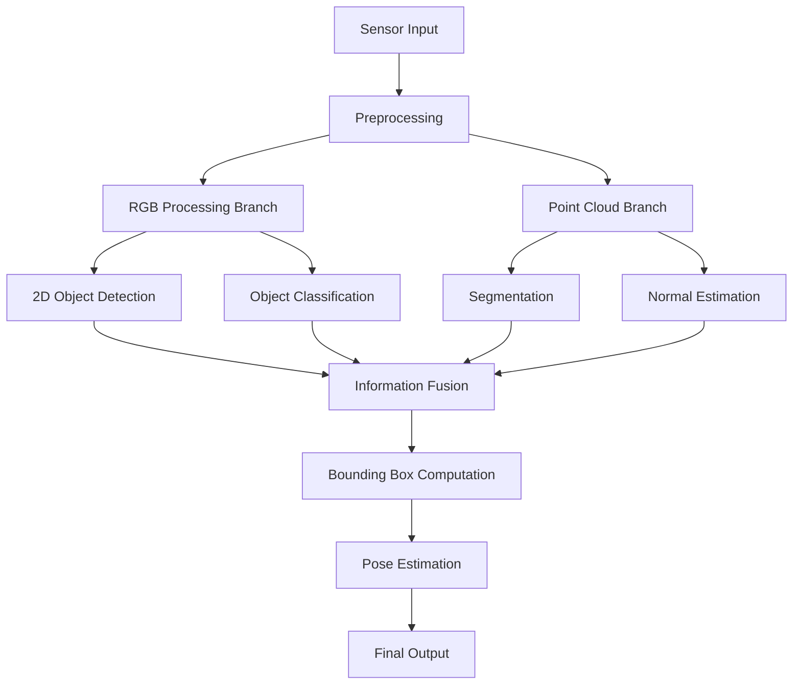

# To DO
- [x] Custom message for PC DET
- [x] Custom message for RGB DET
- [x] modify perception to publish clusters in Custom msg
- [x] py script to visualize clusters
- [ ] remove plane
- [ ] publish tf2 for each cluster Eigen Vectors + normal estimation(plane)
- [x] RGB DET NODE
- [x] FUSING NODE
- [ ] RGB DET NODE (migrate -> client)
- [ ] 6DOF
- [ ] Testing on real feed
---

